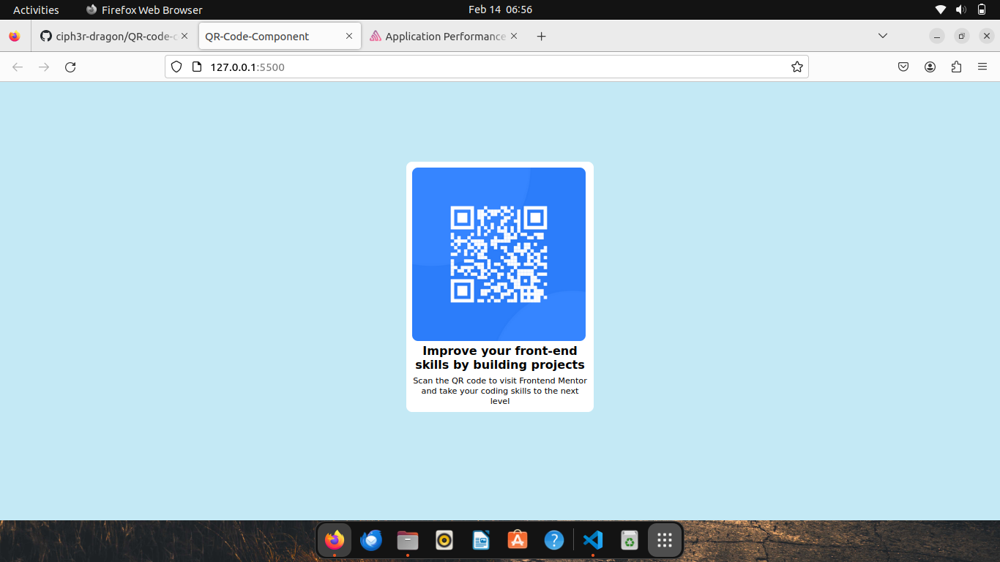

# Frontend Mentor - QR code component solution

This is a solution to the [QR code component challenge on Frontend Mentor](https://www.frontendmentor.io/challenges/qr-code-component-iux_sIO_H). Frontend Mentor challenges help you improve your coding skills by building realistic projects.

## Table of contents

- [Overview](#overview)
  - [Screenshot](#screenshot)
  - [Links](#links)
- [My process](#my-process)
  - [Built with](#built-with)
  - [What I learned](#what-i-learned)
  - [Continued development](#continued-development)
  - [Useful resources](#useful-resources)
- [Author](#author)
- [Acknowledgments](#acknowledgments)

## Overview

### Screenshot

### Links

- Solution URL: (https://github.com/ciph3r-dragon/QR-code-component)
- Live Site URL: (https://drive.google.com/file/d/1VxVEdV0VugXIW9ocMTEhP6m0D0X1l0no/view?usp=drive_link)

## My process

### Built with

- Semantic HTML5 markup
- CSS custom properties
- Flexbox

### What I learned

I had the oppurtunity to better understand unit and measurements when making use of css.

## Author

- Frontend Mentor - [@ciph3r-dragon](https://www.frontendmentor.io/profile/ciph3r-dragon)
- Twitter - [@ciph3r_dragon](https://www.twitter.com/ciph3r_dragon)

## Acknowledgments

My acknowledgments goes to Frontend Mentor for setting up such an amazing resource to help the developers upskill.
